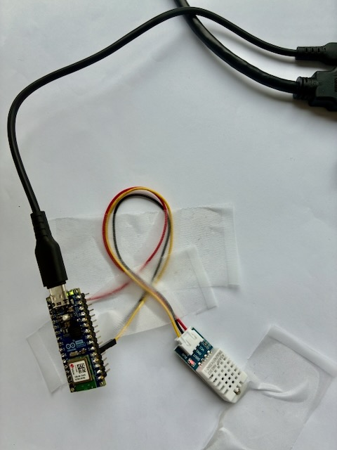

# Progress log – Bosporus

This dated log documents the proceess and the key steps, and the progress of the project along with its artifacts.

---

## *10.07.2026* – Phase 1: Sensor node soldering & first readings

**What I did**
**Setup HW**
Soldered the two 15-pin header strips onto the Arduino Nano ESP32 (first solder joints
in a while — a bit rough around the edges, but electrically sound). Wired the DHT22 to
the board on a breadboard (VCC → 3V3, DATA → D2, GND → GND). 
**Setup development environment**
Set up PlatformIO in VS Code and 
Add DHT library
Add the code to src/main.cpp
Flashed a first code to read temperature and humidity.

**Artifacts**

Soldered board, top view:


Soldered board, angled view:


Serial monitor output, confirming the sensor is being read correctly:

```
Humidity: 40.00 %  Temperature: 28.80 °C
Humidity: 40.00 %  Temperature: 28.80 °C
Humidity: 39.80 %  Temperature: 28.80 °C
Humidity: 39.70 %  Temperature: 28.80 °C
Humidity: 39.50 %  Temperature: 28.80 °C
```

**What went wrong / what I learned**

- First soldering attempt in a long time — needed a refresher on heating the joint (not
  the solder) before feeding solder in.
- Initial header pins were too thick for the breadboard when inserted at an angle;
  fixed by inserting straight down.
- Hit a `'Serial' does not name a type` compile error caused by a mismatched brace, not
  an actual `Serial` problem — a good reminder that C++ error messages sometimes point
  at the *symptom* location, not the *cause* location.

**Result**

✅ End-to-end proof that the sensor node hardware and firmware work: soldering → wiring
→ code → live sensor readings.

---

## *(add date)* – Phase 2: Embedded Linux gateway

*(fill in once you start this phase — same structure: what you did, evidence, what went
wrong, result)*

---

### Template for new entries

```
## <date> – <phase / topic>

**What I did**

**Evidence**

**What went wrong / what I learned**

**Result**
```
