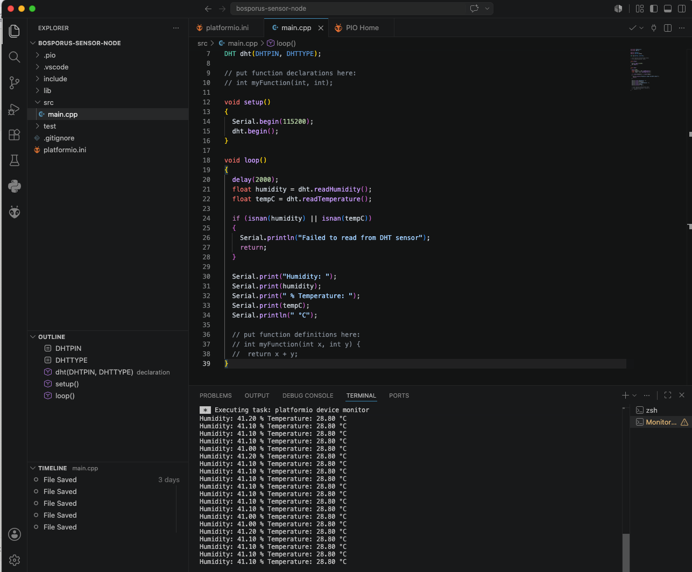

# Progress log – Bosporus

This dated log documents the proceess and the key steps, and the progress of the project along with its artifacts.

---

## *10.07.2026* – Phase 1: Sensor node soldering & first readings

### What I did

**HW Setup**
Soldered the two 15-pin header strips onto the Arduino Nano ESP32 (first solder joints
in a while — a bit rough around the edges, but electrically sound). Wired the DHT22 to
the board on a breadboard (VCC → 3V3, DATA → D2, GND → GND). 
 
**Setup development environment**
- Set up PlatformIO in VS Code and 
- Add DHT library
- Add the code to src/main.cpp
- Flashed a first code to read temperature and humidity.

**Artifacts**


Serial monitor output, confirming the sensor is being read correctly:


**What went wrong / what I learned**

- First soldering attempt in a long time — needed a refresher on heating the joint (not
  the solder) before feeding solder in.
- Initial header pins were too thick for the breadboard when inserted at an angle;
  fixed by inserting straight down.
- Hit a `'Serial' does not name a type` compile error caused by a mismatched brace, not
  an actual `Serial` problem — a good reminder that C++ error messages sometimes point
  at the *symptom* location, not the *cause* location.

**Result**

✅ End-to-end proof that the sensor node hardware and firmware work: soldering → wiring
→ code → live sensor readings.

---

## *16.07.2026* – Phase 2: Embedded Linux gateway

### What I did
**HW Setup**

**Computer** 
Macbook Air, Apple M3

**Raspberry Pi 4 Model B**
For this project, I wanted to learn embedded Linux in a realistic context — and IoT projects are a natural fit for that, because they almost always call for a gateway in the design. Choosing to build one gave me a concrete reason to get hands-on with embedded Linux, rather than learning it in the abstract.
A gateway earns its place in an IoT architecture for three main reasons:

Centralized connectivity — sensors don't each need their own network hardware; the gateway handles that once, for all of them. The Raspberry Pi covers this well, with WiFi, Ethernet (useful as a stable fallback), and Bluetooth built in.
Centralized security — patching, firewalling, and access control happen on one device instead of being replicated (and potentially neglected) across every sensor node — which is both more secure and cheaper to maintain at scale.
A proper OS for real services — running things like Mosquitto, a database, and Grafana requires a full filesystem, networking stack, and process management — capabilities a microcontroller doesn't have, but a real OS does.

I chose the Raspberry Pi specifically as my learning vehicle for embedded Linux. Compared to alternatives like the Orange Pi or BeagleBone Black, it has the strongest documentation and the largest community — which matters most when you're learning, since it means more tutorials and faster troubleshooting when something goes wrong.

**MicroSD:** Samsung EVO Plus (128 GB, microSDXC, U3, UHS-I)
Because the Pi has no built-in storage, no internal flash, no eMMC. This is the only storage for everything: OS, logs, permanent home of the OS. Every time Pi boots, reads a file or writes a log. 

**Card Reader:** StarTech USB 3.0 card reader with USB-C
I ordered this card reader with USB-C so that I can read the SD card with my MacBook Air, because my MacBook Air does not have a built-in interface capable of reading SD cards. 

**Ethernet adapter** Belkin USB-C auf Gigabit Ethernet Adapter
The Ethernet adapter is the backup for a stable connection if Wifi or mDNS doesnt work. bosporus.local resolves to an IP address via mDNS. If this fails, I need to connect by IP address directly, using a wired connection, which is more predictable. 

**SW Setup**

**Step 1** Prove Pi works with standard Raspberyy Pi OS.

**Installation and Configuration Raspberry Pi Imager** 
I have downloaded the imager_2.0.10.dmg from raspberrypi.com/software and installed onto the Applications folder on my MacBook Air. Then I have launched the imager in the Applications folder and the following configurations:
- selected **Raspberry Pi 4**
- selected **Raspberyy Pi OS (other)** and then **Raspberry Pi OS Lite (64-bit)**
- confirmed SD card size - 119.4 GB
- ticked "Exclude system drives" to prevent erasing my Mac's startup disk accidentally
- defined **Hostname:** bosporus, **Time zone:** Eurpoe/Zurich, **Keyboard layout:** Swiss German (ch), then username and password and enabled **SSH**

**Writing the Standard Linux OS into SD Card**
- Powered Raspberry Pi, RED LED lightnin solid, Green LED blinking
- insert the SD Card into the socket on the Raspberry Pi
- Accessing the Raspberry Pi with **ssh boncuk@bosporus.local**

**Evidence**
- ping bosporus.local results as ``ING bosporus.local (192.168.1.170): 56 data bytes
64 bytes from 192.168.1.170: icmp_seq=0 ttl=64 time=10.223 ms
64 bytes from 192.168.1.170: icmp_seq=1 ttl=64 time=15.288 ms
64 bytes from 192.168.1.170: icmp_seq=2 ttl=64 time=15.102 ms
64 bytes from 192.168.1.170: icmp_seq=3 ttl=64 time=16.623 ms
64 bytes from 192.168.1.170: icmp_seq=4 ttl=64 time=16.508 ms
64 bytes from 192.168.1.170: icmp_seq=5 ttl=64 time=16.110 ms``
. That means Pi is fully up and reachable on my network.
- Accessing with **ssh boncuk@bosposrus.local** connection refused. The Problem lies that ssh server unreachable. The trick "headless SSH enable" with **touch /Volumes/bootfs/ssh** then eject the bootfs with **diskutil eject /Volumes/bootfs**
- Next accesing try with **ssh boncuk@bosposrus.local** results with ``The authenticity of host 'bosporus.local (2a02:169:1f0:0:2ecf:67ff:fe54:ac07)' can't be established.
ED25519 key fingerprint is SHA256:xXlo3N5Eoltn/7qn+HR8HrAeZsaEHk4xM359dxpS9m8.
This key is not known by any other names.
Are you sure you want to continue connecting (yes/no/[fingerprint])?``.
- Answering with yes results ``Warning: Permanently added 'bosporus.local' (ED25519) to the list of known hosts.
Connection closed by 2a02:169:1f0:0:2ecf:67ff:fe54:ac07 port 22``
- Next try to call ssh sehrver with **ssh boncuk@bosporus.local** prompted to enter the password. Entering the password results ``% ssh boncuk@bosporus.local
boncuk@bosporus.local's password: 
Linux bosporus 6.18.34+rpt-rpi-v8 #1 SMP PREEMPT Debian 1:6.18.34-1+rpt1 (2026-06-09) aarch64
The programs included with the Debian GNU/Linux system are free software;
the exact distribution terms for each program are described in the
individual files in /usr/share/doc/*/copyright.
Debian GNU/Linux comes with ABSOLUTELY NO WARRANTY, to the extent
permitted by applicable law.
_____________________________________________________________________
WARNING! Your environment specifies an invalid locale.
 The unknown environment variables are:
   LC_CTYPE=UTF-8 LC_ALL=
 This can affect your user experience significantly, including the
 ability to manage packages. You may install the locales by running:
 sudo dpkg-reconfigure locales
 and select the missing language. Alternatively, you can install the
 locales-all package:
 sudo apt-get install locales-all
To disable this message for all users, run:
   sudo touch /var/lib/cloud/instance/locale-check.skip
_____________________________________________________________________
-bash: warning: setlocale: LC_CTYPE: cannot change locale (UTF-8): No such file or directory
-bash: warning: setlocale: LC_CTYPE: cannot change locale (UTF-8): No such file or directory
-bash: warning: setlocale: LC_CTYPE: cannot change locale (UTF-8): No such file or directory
-bash: warning: setlocale: LC_CTYPE: cannot change locale (UTF-8): No such file or directory
-bash: warning: setlocale: LC_CTYPE: cannot change locale (UTF-8): No such file or directory
-bash: warning: setlocale: LC_CTYPE: cannot change locale (UTF-8): No such file or directory
-bash: warning: setlocale: LC_CTYPE: cannot change locale (UTF-8): No such file or directory
-bash: warning: setlocale: LC_CTYPE: cannot change locale (UTF-8): No such file or directory`` 

- Updating the Pi with **sudo apt-get update** and **sudo apt-get install -y locales-all** removes the warnings and I am on the Pi: ``Reading package lists... Done
Building dependency tree... Done
Reading state information... Done
locales-all is already the newest version (2.41-12+rpt1+deb13u3).
0 upgraded, 0 newly installed, 0 to remove and 56 not upgraded.
boncuk@bosporus:~ $``

**What went wrong / what I learned**

**Result**
```
