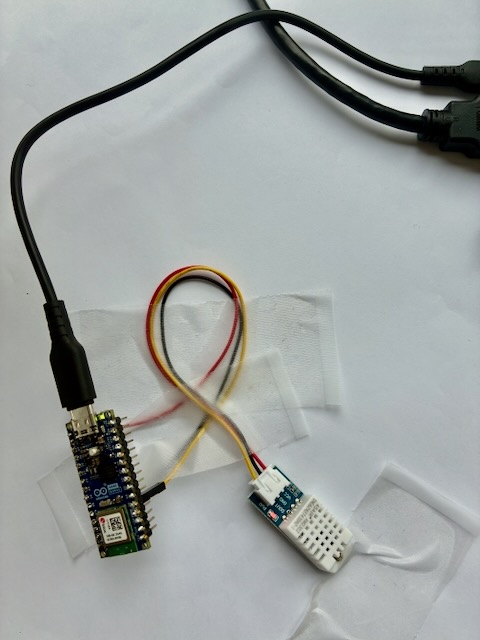
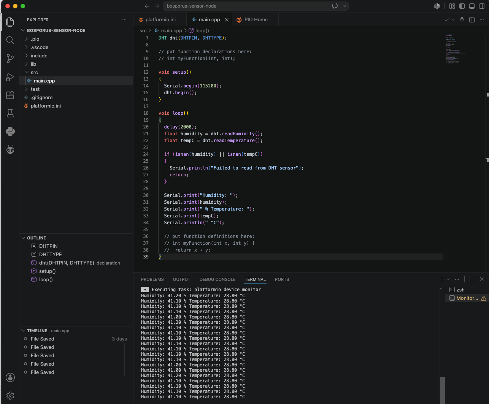

# Progress log – Bosporus

This dated log documents the process and the key steps, and the progress of the project along with its artifacts.

---

## *10.07.2026* – Phase 1: Sensor node soldering & first readings

### What I did

**HW Setup**

Soldered the two 15-pin header strips onto the Arduino Nano ESP32 (first solder joints
in a while — a bit rough around the edges, but electrically sound). Wired the DHT22 to
the board on a breadboard (VCC → 3V3, DATA → D2, GND → GND).

**SW Setup**
- Set up PlatformIO in VS Code
- Added the DHT library
- Added the code to `src/main.cpp`
- Flashed a first build to read temperature and humidity

**Artifacts**



Serial monitor output, confirming the sensor is being read correctly:



**What went wrong / what I learned**

- First soldering attempt in a long time — needed a refresher on heating the joint (not
  the solder) before feeding solder in.
- Initial header pins were too thick for the breadboard when inserted at an angle;
  fixed by inserting straight down.
- Hit a `'Serial' does not name a type` compile error caused by a mismatched brace, not
  an actual `Serial` problem — a good reminder that C++ error messages sometimes point
  at the *symptom* location, not the *cause* location.

**Result**

✅ End-to-end proof that the sensor node hardware and firmware work: soldering → wiring
→ code → live sensor readings.

---

## *16.07.2026 – 05.08.2026* – Phase 2: Embedded Linux gateway

### What I did

**HW Setup**

**Computer**
MacBook Air, Apple M3

**Raspberry Pi 4 Model B**

For this project, I wanted to learn embedded Linux in a realistic context — and IoT
projects are a natural fit for that, because they almost always call for a gateway in
the design. Choosing to build one gave me a concrete reason to get hands-on with
embedded Linux, rather than learning it in the abstract.

A gateway earns its place in an IoT architecture for three main reasons:

1. **Centralized connectivity** — sensors don't each need their own network hardware;
   the gateway handles that once, for all of them. The Raspberry Pi covers this well,
   with WiFi, Ethernet (useful as a stable fallback), and Bluetooth built in.
2. **Centralized security** — patching, firewalling, and access control happen on one
   device instead of being replicated (and potentially neglected) across every sensor
   node — which is both more secure and cheaper to maintain at scale.
3. **A proper OS for real services** — running things like Mosquitto, a database, and
   Grafana requires a full filesystem, networking stack, and process management —
   capabilities a microcontroller doesn't have, but a real OS does.

I chose the Raspberry Pi specifically as my learning vehicle for embedded Linux.
Compared to alternatives like the Orange Pi or BeagleBone Black, it has the strongest
documentation and the largest community — which matters most when you're learning,
since it means more tutorials and faster troubleshooting when something goes wrong.

**MicroSD:** Samsung EVO Plus (128 GB, microSDXC, U3, UHS-I)

The Raspberry Pi has no internal storage of its own — no built-in flash, no eMMC. The
microSD card is therefore the Pi's only storage device, holding the OS, all files, and
logs for as long as it runs. Every time the Pi boots, reads a file, or writes a log, it
does so on this card.

**Card Reader:** StarTech USB 3.0 card reader with USB-C

I ordered this card reader with USB-C so that I can read the SD card with my MacBook
Air, because my MacBook Air does not have a built-in interface capable of reading SD
cards.

**Ethernet adapter:** Belkin USB-C to Gigabit Ethernet Adapter

The Ethernet adapter is the backup for a stable connection if WiFi or mDNS doesn't
work. `bosporus.local` resolves to an IP address via mDNS. If this fails, I need to
connect by IP address directly, using a wired connection, which is more predictable.

**SW Setup**

### Step 1: Prove the Pi works with standard Raspberry Pi OS

*Installation and configuration of Raspberry Pi Imager*

I downloaded `imager_2.0.10.dmg` from raspberrypi.com/software and installed it into
the Applications folder on my MacBook Air. I then launched the Imager and used the
following configuration:
- Selected **Raspberry Pi 4**
- Selected **Raspberry Pi OS (other)**, then **Raspberry Pi OS Lite (64-bit)**
- Confirmed the SD card size — 119.4 GB
- Ticked "Exclude system drives" to prevent accidentally erasing my Mac's startup disk
- Set **Hostname:** `bosporus`, **Time zone:** Europe/Zurich, **Keyboard layout:**
  Swiss German (ch), then a username and password, and enabled **SSH**

*Writing the standard Linux OS onto the SD card and first boot*
- Inserted the SD card into the Raspberry Pi's card slot
- Powered the Raspberry Pi — RED LED lit solid, GREEN LED blinking (indicating active boot)
- Attempted to access the Raspberry Pi with `ssh boncuk@bosporus.local`

### Step 2: Configure and build the Buildroot image, flash it onto the Raspberry Pi

Plan: Docker Desktop → Buildroot source → configure → build → flash → boot my own image.

**Installing Docker Desktop**

Docker is the environment used to build the Buildroot image, since Buildroot requires
a Linux machine and my Mac isn't one. Docker Desktop works by running a small Linux
virtual machine in the background — it's just a convenient way to get a Linux computer
on my Mac. Professional embedded workflows run on actual Linux machines; building
Linux images belongs on Linux. Docker-on-Mac is a practical personal-development
bridge to get there without owning a Linux machine, not a professional release process.

- Installed Docker Desktop from docker.com/products/docker-desktop → "Download for Mac – Apple Silicon"
- Installed `Docker.dmg` into Applications
- Confirmed with `docker run --rm hello-world` → resulted in "Hello from Docker!"

**Get the Buildroot source**

This is done inside a Linux container, not directly on my Mac:

```bash
docker run -it --rm -v $(pwd)/buildroot-workspace:/home/builder -w /home/builder ubuntu bash
```
- Starts a fresh Ubuntu Linux container
- `-v $(pwd)/buildroot-workspace:/home/builder` creates a **bind mount** — a two-way
  link between `buildroot-workspace` on my Mac's real filesystem and `/home/builder`
  inside the Linux container, so files persist even after the container closes
- `-w /home/builder` drops me into a bash shell inside Linux, in that directory

Installed the build dependencies, since Buildroot needs a fairly long list of standard
Linux build tools:
```bash
apt-get update && apt-get install -y build-essential git wget cpio unzip rsync bc python3 libncurses-dev
```

Cloned Buildroot itself:
```bash
git clone https://github.com/buildroot/buildroot.git
```
`git clone` downloads a complete copy of a Git repository. Buildroot's GitHub repo *is*
Buildroot — a large collection of Makefiles, package recipes, board-specific
defconfigs, and Kconfig menu definitions. This pulled the actual Buildroot source tree.
(Note: this GitHub repo is a read-only mirror — Buildroot's actual development happens
on GitLab, via a mailing-list patch review process, not GitHub pull requests.)

**Configure Buildroot**
- `make raspberrypi4_defconfig` — copies a pre-made template configuration into the
  project as the active `.config`. For the Pi 4, this template already contains the
  correct CPU architecture, bootloader, kernel version, and device tree — my starting
  point, pre-filled with sensible settings for this exact board.
- `make menuconfig` — opens a text-based, keyboard-navigated menu. Added the four
  packages the gateway needs on top of the baseline: Mosquitto, Dropbear + OpenSSH,
  Python3, and SQLite.
  - Target packages → Networking applications → `mosquitto`, `dropbear`, `openssh` (Space to select each)
  - Target packages → Interpreter languages and scripting → `python3`
  - Target packages → Libraries → Database → `sqlite`
  - Exit and save (Esc, Esc) — writes the selections into `.config`

**Build**

Ran `make` — first attempt failed almost immediately:
```
You must install '/usr/bin/file' on your build machine
```
Fixed with `apt-get install -y file`, then reran `make`.

Second attempt got much further (downloading and cross-compiling the toolchain,
kernel, bootloader, and every selected package — over an hour of work), then failed
differently:
```
chmod: changing permissions of '.../host-m4-1.4.21/bootstrap': Permission denied
```
This is a known Docker Desktop-on-Mac limitation: Docker doesn't talk to a bind-mounted
folder directly the way real Linux would. It goes through a translation layer called
**VirtioFS** that bridges macOS's filesystem to the Linux container, and that layer has
a specific bug where files extracted with certain permission bits can't be `chmod`'d
afterward — even as root. Buildroot does this exact "extract, then chmod" pattern for
every package, so this was going to keep recurring.

**Fix:** stopped using a bind mount, switched to a Docker-managed **named volume**
instead (which doesn't go through that same host-translation layer):
```bash
docker volume create buildroot-vol
docker run -it --name buildroot-builder -v buildroot-vol:/home/builder -w /home/builder ubuntu:24.04 bash
```
Redid the setup in this fresh container (dependencies, clone, defconfig, menuconfig
with the same four packages), then ran `make` again — completed successfully this time.

Confirmed the build output:
```bash
ls -lh output/images/
```
→ `sdcard.img` (153M), `zImage`, `rootfs.ext2`/`rootfs.ext4`, four `bcm2711-*.dtb`
variants, `boot.vfat`, `genimage.cfg` — every piece Buildroot is supposed to produce.

**Checking login before flashing — this saved me from being locked out**

Since a named volume isn't directly browsable from Finder, getting the file onto my
Mac needs an explicit copy step:
```bash
docker cp buildroot-builder:/home/builder/buildroot/output/images/sdcard.img ~/bosporus-sdcard.img
```
(First attempt at this failed with `bash: docker: command not found` — I'd
accidentally run it *inside* the container. `docker` is a Mac-side command; it manages
containers from the outside, so this has to run from a normal Mac terminal, not from
within the container itself.)

Before flashing, checked whether login would even be possible:
```bash
cat output/target/etc/shadow | head -3
```
```
root::::::::
daemon:*:::::::
bin:*:::::::
```
The empty second field on `root` confirmed no password was set at all. Dropbear (the
SSH server) specifically refuses network login with a blank password even though the
account itself has none — so flashing as-is would have locked me out with no serial
console as a fallback. Fixed via:
```
make menuconfig → System configuration → Root password → make
```

**Flashing and first boot of the custom image**
- Got the updated image onto my Mac with `docker cp` (run correctly this time, from a
  normal Mac terminal) and confirmed with `ls -lh ~/bosporus-sdcard.img`
- Raspberry Pi Imager → Choose OS → scrolled to the bottom → **"Use custom"** →
  selected `~/bosporus-sdcard.img`
- Choose Storage → SD card → Write
- Inserted the SD card into the Pi, then powered it on
- LEDs: RED solid, GREEN blinking every 3–4 seconds — a slow, regular "heartbeat"
  pattern, different from the rapid flickering seen during standard-OS boot, suggesting
  the kernel had fully booted (heartbeat LED only activates once Linux is running)

**Connecting — the actual troubleshooting stretch**

`ssh root@bosporus.local` hung indefinitely. Diagnosed as: the custom image has no
WiFi configured at all — unlike Raspberry Pi Imager, `menuconfig` never asks for WiFi
credentials, and I never added `wpa_supplicant` or any WiFi firmware package. The Pi
had booted but never joined the network.

First fix attempt: connected the Pi directly to my Mac via the Ethernet adapter —
still no connection. Cause: no DHCP server in a direct Pi-to-Mac link (a router
normally provides DHCP; my Mac doesn't). **Actual fix:** connected the Pi's Ethernet
port to the router instead, which got it a real IP via DHCP: `192.168.1.169`.

```bash
ssh root@192.168.1.169
```
connected and prompted for a password — entering the password I'd set (`bosporus74`)
resulted in `Connection closed by 192.168.1.169 port 22`. Retyped manually (not pasted)
— got `Permission denied, please try again` three times in a row.

Debugged systematically rather than continuing to guess:
- `grep ROOT_PASSWD .config` → confirmed `bosporus74` was genuinely saved
- `cat output/target/etc/shadow | head -1` → confirmed a real password hash existed
- `cat output/target/etc/init.d/S50dropbear` → checked for a `-w` flag (which would
  disable root login entirely, regardless of password) — confirmed absent

Reset to a deliberately simple password (`test1234`) to rule out a typing/Caps-Lock
issue, rebuilt, re-copied, reflashed. Still got "Permission denied." Checked
`ls -lh ~/bosporus-sdcard.img` — confirmed the image file itself was genuinely fresh.

Noticed the Pi's IP address hadn't changed across reflashes, and initially treated that
as suspicious — but the IP is assigned by the router based on the Pi's **MAC address**,
not its software, so an unchanged IP proves nothing about which image is actually
running.

Final `ssh root@192.168.1.169` attempt triggered:
```
WARNING: REMOTE HOST IDENTIFICATION HAS CHANGED!
```
Correctly recognized this as **expected**, not an attack: a fresh filesystem generates
fresh SSH host keys, so this was actual proof the newest image was finally running.
Cleared the stale entry with `ssh-keygen -R 192.168.1.169`, reconnected, accepted the
new host key, entered `test1234` —

**successful login to my own custom-built Buildroot Linux system.**

**Artifacts**


**What went wrong / what I learned**

- While flashing the standard Raspberry Pi OS: SSH was refused because the server
  wasn't reachable — fixed with the boot-partition `touch .../ssh` trick. A password
  paste attempt also caused a silent connection failure; typing manually resolved it.
- `make` failed first on a missing `file` package — fixed with `apt-get install -y file`.
- `make` failed a second time on `chmod: Permission denied` during package extraction —
  a known Docker Desktop-on-Mac VirtioFS bind-mount bug. Fixed by switching from a bind
  mount to a Docker-managed named volume.
- `docker cp` doesn't run inside a container — it's a Mac-side command for moving files
  across the container boundary, and has to run from a normal Mac terminal.
- A blank root password blocks SSH login entirely (Dropbear refuses blank-password
  logins over the network), even though the same account would work fine on a local
  console — worth checking `/etc/shadow` **before** flashing, not after being locked out.
- Buildroot's `menuconfig` has no WiFi setup step — unlike Raspberry Pi Imager, WiFi
  has to be deliberately configured, or wired Ethernet has to be used instead.
- A direct Ethernet cable between two devices doesn't give either one an IP address
  without a DHCP server somewhere in the loop (normally the router's job).
- An SD card's IP address is tied to the Pi's hardware (MAC address), not to whatever
  OS/image happens to be on the card — it does not change across reflashes, and is not
  evidence of which image is currently running.
- A "REMOTE HOST IDENTIFICATION HAS CHANGED" SSH warning isn't automatically suspicious
  — a freshly flashed system genuinely does generate new host keys, and `ssh-keygen -R`
  is the correct, safe way to clear the outdated entry once you know why it changed.

**Result**

✅ Custom Buildroot image built from source and successfully booted on the Raspberry Pi 4,
with SSH access confirmed via a manually set root password — the core Phase 2
milestone from the project plan: *"Custom Linux image boots on the Pi."*

✅ Verification the selected packages that are actually present and working
- run uname -a: prints out the kernel name, kernel release version, hostname, build date/time, CPU architecture and operating system family.
- which mosquitto, python 3, sqlite3: where exactly on disk is the program execute.
```
(base) adablackjack@Adas-MacBook-Air ~ % ssh root@192.168.1.169
root@192.168.1.169's password: 
# uname -a
Linux buildroot 6.12.61-v7l #1 SMP Tue Jul 28 18:07:57 CEST 2026 armv7l GNU/Linux
# which mosquitto
/usr/sbin/mosquitto
# which python3
/usr/bin/python3
# which sqlite3
/usr/bin/sqlite3
# uname -a
Linux buildroot 6.12.61-v7l #1 SMP Tue Jul 28 18:07:57 CEST 2026 armv7l GNU/Linux
# 
```
## *11.08.2026 – * – Phase 3: Integration

**Start Mosquitto on the Pi, confirm it's actually listening on the network**

Mosquitto is one specific piece of SW that implements the protocol MQTT (Message Queuing Telemetry Transport). It is a lightweight and suitable for use on from low power single board computers to full servers, sending small messages. 
```
mosquitto -v &
```
mosquitto is already running, check that
```
ps | grep mosquitto
```
This results as
```
176 nobody   /usr/sbin/mosquitto -c /etc/mosquitto/mosquitto.conf
```
Then, check what its real config allows
```
cat /etc/mosquitto/mosquitto.conf
```
I were specificall looking for whether **listener** line and **allow_anonymous** is set, which tell us whether mosquitto accepts connections from ESP32 and whether I need to edit this file and restart the service. 
```
grep -E '^(listener | allow_anonymous)' /etc/mosquitto/mosquitto.conf
```
results with empty means no active **listener** and **allow_anonymous** line exists anywhere in the config file.
**add a listener**
The existing config file is entirely comments and defaults. The cleanest approach is a small separate config file rather than editing this large one. 
```
mkdir -p /etc/mosquitto/conf.d
cat > /etc/mosquitto/conf.d/bosporus.conf << 'EOF'
listener 1883 0.0.0.0
allow_anonymous true
EOF
```
Then restart mosquitto so it picks up the new config
```
kill 176
mosquitto -d -c /etc/mosquitto/mosquitto.conf
```

**Test it from your Mac using a simple command-line MQTT client**

**Update the ESP32 firmware to connect to WiFi and publish real sensor readings via MQTT**
**Write the gateway-side Python script that subscribes and writes readings into SQLite**


